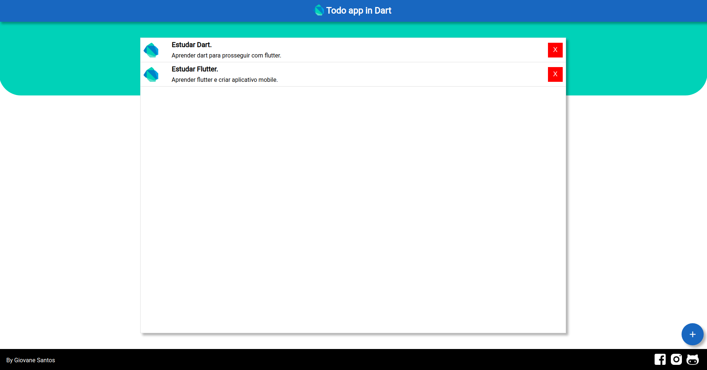

# Todo app in Dart
###### Author: [Giovane Santos](https://www.linkedin.com/in/giovane-santos-silva-a63790156/)

---
#### Description:
Small application of tasks using Dart.

#### Configure:
Configure and install [Dart](https://dart.dev/get-dart) 

### How to use:
##### Install
    pub global activate webdev
    pub get 
    webdev build
    webdev serve
    
### Result:
   
    